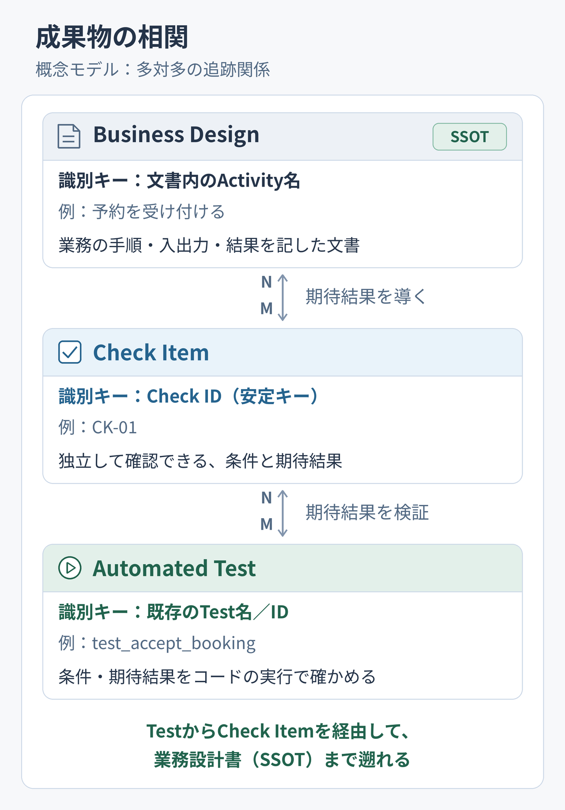
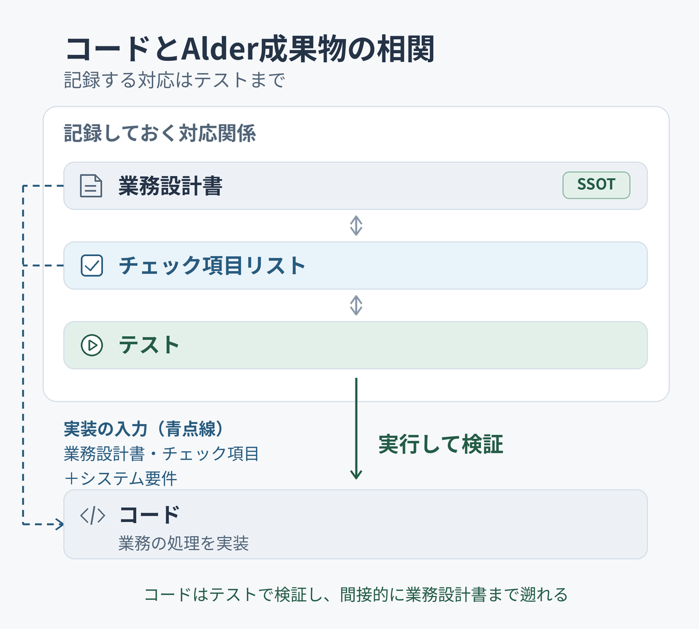
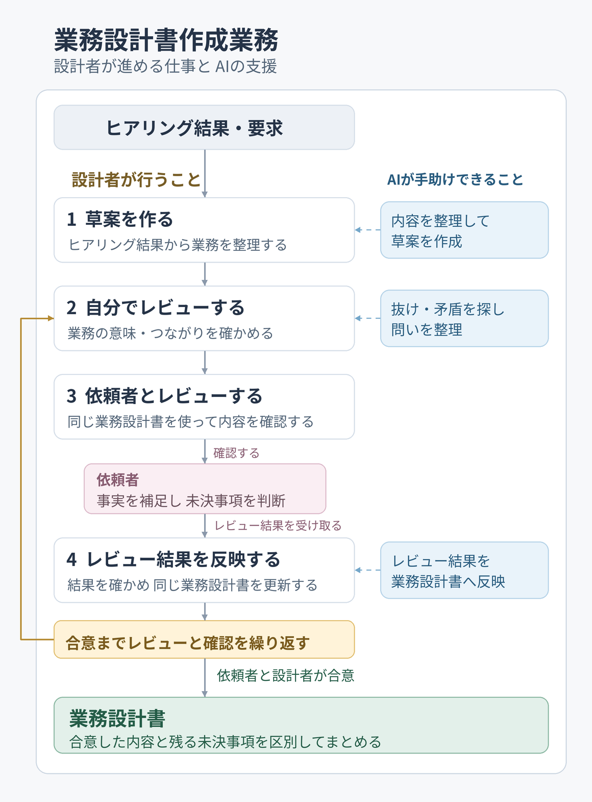
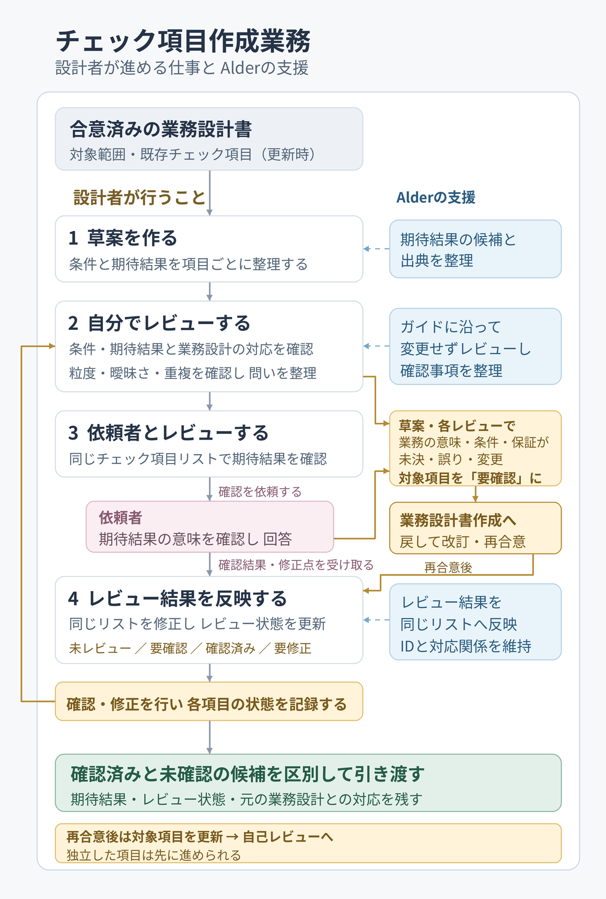
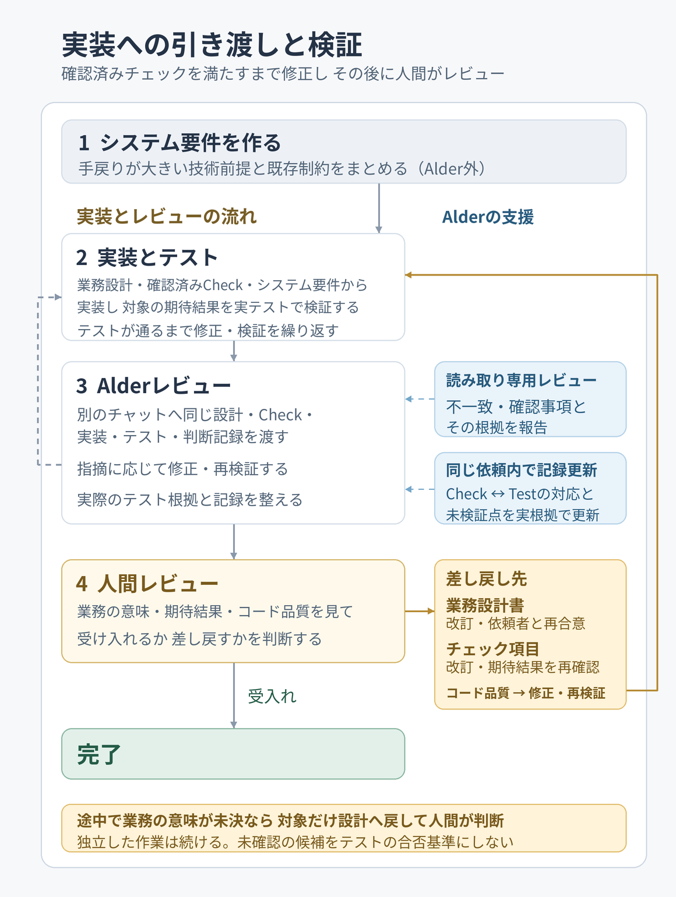
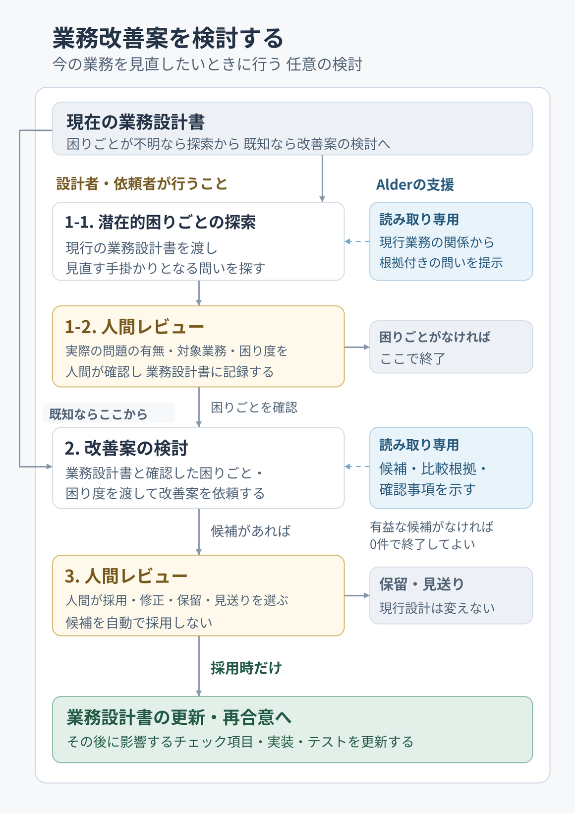

# Alder — 依頼者と業務設計書で話そう

[English](README.md) | 日本語

**依頼者と合意した業務を動くシステムへ。**

Alderは依頼者の要求を、依頼者・設計者・実装者が共通の言葉で理解できる**業務設計書**（Business Design）に整理します。そして、依頼者と設計者が合意した内容を**業務上の正本**（SSOT）として、検査項目・コード・テストへつなげます。

フレームワークや実行時パッケージは不要です。

## 導入する

ChatGPT / Codexを利用できる契約・権限のあるアカウントと環境を用意してください。Codex CLIを用意し、次のコマンドでAlderの配布元（marketplace）を登録してください。

```sh
codex plugin marketplace add mk3008/alder --ref plugin-v0.4.5
```

コマンド実行後は、ChatGPTデスクトップアプリを再起動してください。次に、Plugins Directoryで**Alder development**を選び、**Alder**をインストール・有効化してください。その後は新しいチャットを開始してください。

## まず使ってみる

業務ヒアリングから業務設計書を作るには、新しいチャットで次のプロンプトを送ってみてください。

```text
このヒアリング結果をAlder業務設計書にして。

団体が所有する工具を、登録済みの地域住民に貸し出しています。
貸出・返却の記録には、貸し出した工具番号と付属品一覧、引渡しの記録があります。
返却時は窓口で現物の番号と付属品をこの記録と照合し、照合結果と返却日時を記録します。
貸出の受渡しは署名と引き渡しの記録、返却の受領は照合と返却日時の記録で確認します。
返却された組は整備担当の点検を待ちます。
```

次のような構造化された業務設計書が得られます。

```markdown
# Activity 工具の返却受付

## When

住民が貸し出された工具を返却するとき。

## Who

窓口

## How

### Input

- 登録済み地域住民 — 返却する工具と付属品
- 貸出・返却の記録 — 貸し出した工具番号と付属品一覧、引渡しの記録

### Procedure

1. 窓口は貸し出した番号と返却された現物の番号・付属品を照合し、返却日時を記録する。記録媒体は未確認。
2. 返却された組は整備担当の点検を待つ。具体的な引渡し方法は未確認。

### Output

- 貸出・返却の記録 — 照合結果と返却日時の記録
- 団体の工具 — 返却され点検を待つ組

## Result

番号と付属品の照合および返却日時の記録により受領が確認され、組は整備担当の点検を待つ。
```

次はこの草案をレビューし、依頼者と認識を合わせます。合意した業務設計書からは、実装やテストに使うチェック項目をAlderで作れます。具体的な流れは[業務設計書の作成](#業務設計書を作成する)、各項目の意味と構造の理由は[文書構造](docs/business-design-structure.ja.md)を参照してください。

## できること

- ヒアリング結果や要求から業務設計書を作成・改訂できます。
- 業務設計書の抜けや矛盾、前後の業務とのつながりを確認できます。
- 現在の業務の具体的な困りごとに対する改善案を比較できます。
- 合意した業務から検査項目を作り、期待結果を確認できます。
- 実装・DDL・テストが合意した業務に沿っているかをレビューできます。

## Alderの成果物

Alderで作成し、実装へ引き渡す主な成果物は、業務設計書とチェック項目です。

- **業務設計書（Business Design）**：業務の手順・入出力・結果を記します。依頼者と設計者が読み、修正し、合意する、業務上の正本です。
- **チェック項目（Check Item）**：合意した業務から、システムが満たすべき条件と期待結果を整理します。業務設計書の根拠と、実装後のテストによる検証根拠を保持します。

実装側はこの二つをもとにCode・DDL・テストを作り、重要な実装判断と理由を判断記録に残します。技術的な詳細は実装で具体化し、同じ業務の意味を別の詳細設計書へ重複して書き直しません。そのため、同期・保守する文書を増やさずに済みます。

ビューやGraph JSONなど、自動導出できる情報は正本から必要に応じて生成します。人間が意味をレビューできない機械専用表現やfingerprintは、業務上の正本や合意の代わりにはなりません。

### 成果物の相関

業務設計書とテストは、チェック項目を介して結び付きます。各項目に、次の二つの参照を記録します。

- **業務設計書への参照**：チェック項目の条件・期待結果の根拠となる箇所を示します。参照元文書とActivity名などの人間可読な識別子を使い、必要ならProcedure / Resultまでたどれるようにします。Activityに機械的な固定IDは要求しません。
- **テストへの参照**：その条件・期待結果を検証する代表テストとassertionを示します。テスト名と参照先で対象を特定します。

<a href="docs/images/traceability-model.ja.png"></a>

業務設計書とチェック項目、チェック項目とテストは、それぞれ多対多（N:M）で結び付きます。一つのチェック項目が複数の業務を根拠にしたり、複数のテストで検証されたりすることがあります。逆に、一つの業務やテストが複数のチェック項目に関係することもあります。

この相関から、業務上の期待をどのテストが検証するかをたどり、テストからその根拠となる業務まで逆引きできます。

対応を記録する時期と方法は、[チェック項目の追跡関係](docs/check-item-traceability.md)を参照してください。

### コードとAlder成果物の相関

合意した業務設計書と確認済みのチェック項目を、システム要件とともに実装へ渡します。コードはこれらをもとに作り、テストを実行して条件・期待結果を満たすか確かめます。記録して保守する追跡関係はテストまでです。

<a href="docs/images/traceability-execution.ja.png"></a>

コードと業務設計書の直接の対応表は保守せず、テストからチェック項目を経由して業務上の根拠を確認します。

<a id="標準的な使い方"></a>

## 業務設計書を作成する

Alderは既存業務の分析と新しい業務の仮説に使えます。まず業務設計書を作成し、依頼者と設計者の認識を合わせます。

設計者はヒアリング結果から草案を作り、自分でレビューしたうえで依頼者へ確認します。回答を設計へ反映し、合意までレビューと確認を繰り返します。AIは草案作成、自己レビュー、確認結果に沿った改訂を手助けできます。

<a href="docs/images/business-design-workflow.ja.png"></a>

<a id="1-草案を作り質問に答える"></a>

### 1. 草案を作る

対象プロジェクトのチャットへヒアリング結果や要求を渡し、次のように依頼してください。

```text
このヒアリング結果をAlder業務設計書にして。
docs/business-design/ に草案を作って。
```

機能や手段を提案すると、Alderはその案を採用するかの判断に必要な背景を質問します。すでに伝えた背景や決定事項は聞き直さず、分かっている範囲を草案にし、未決事項を残します。

Alderは不明な条件を推測で埋めず、確認する問いとして残します。設計者は草案を読み、入力した事実と合っているかを確かめてください。

業務設計書は依頼者自身が読める普段の言葉で書かれます。Alderが入出力・手順・結果などの項目へ整理するので、**書式を暗記する必要はありません**。各欄の意味は[文書構造](docs/business-design-structure.ja.md)で確認できます。

<a id="2-業務設計をレビューし依頼者と合意する"></a>

### 2. 自分でレビューする

設計者は草案を読み、仕事の意味や前後の業務とのつながりを確かめます。AIにも次のように依頼すると、記述の曖昧さ、抜けや矛盾、確認すべき問いを探す補助になります。

```text
業務設計書をAlderでレビューして
```

AIの指摘をそのまま仕様にせず、入力事実と照らし合わせてください。設計者が判断できる記述上の問題は直します。あわせて、責任、条件、例外、保証などについて、依頼者に判断してもらう問いを整理します。

<a id="3-依頼者に確認する"></a>

### 3. 依頼者とレビューする

設計者は**業務設計書を依頼者と一緒に読み**、仕事の理解が合っているかを確かめます。問いに関係する入出力・手順・例外などの箇所を示し、何が未決で、回答によってどこが変わるかを説明してください。依頼者は同じ文書を見ながら事実を補足し、未決事項を判断します。

<a id="4-回答を設計へ反映する"></a>

### 4. レビュー結果を反映する

依頼者と確認した結果を業務設計書と一緒にAlderへ渡し、同じ文書の更新を依頼してください。

```text
このレビュー結果を反映して、同じAlder業務設計書を改訂して。
残る未決事項は分けて残して。
```

変更箇所を読み、確認した内容と食い違っていないかを確かめてください。

改訂後は変更した内容を依頼者と確認します。**依頼者と設計者が合意した版が正本**です。Alderは合意した内容と残る未決事項を区別して整理します。技術的な実現手段は後の[実装への引き渡し](#設計とチェック項目を実装へ引き渡す)で扱います。

## チェック項目を作成する

合意した業務設計書から、システムが満たすべき条件と期待結果をチェック項目（Check Item）にします。設計者がAIの草案作成・更新の支援を受け、依頼者と期待結果を確認する業務です。

設計者は草案を作り、自分でレビューしてから依頼者に確認します。AIは草案作成、自己レビュー、確認結果に沿った更新を支援できます。確認結果と残る未決事項を記録し、確認済みの項目と未確認の候補を区別して引き渡します。

<a href="docs/images/check-item-workflow.ja.png"></a>

### 1. チェック項目の草案を作る

合意した業務設計書を、添付するかAIが読める場所に置いて渡してください。更新する場合は既存のチェック項目も渡します。

```text
この業務設計書から、Alderでチェック項目の草案を作って。
```

Alderは各項目に条件・期待結果・業務設計書の根拠とIDを付け、`未レビュー`の草案としてまとめます。根拠への参照を自分で書き足す必要はありません。

### 2. 自分でレビューする

設計者は草案を読み、条件と期待結果が業務設計書の意味と合っているか、曖昧さや重複がないかを確かめます。たとえば「同時申込みでも重複予約が成立しない」なら、どの申込みが重なる場合かも確認します。

業務設計書とチェック項目をAIへ渡し、レビューを手伝わせることもできます。

```text
Alderでこの業務設計書とチェック項目の対応、粒度、曖昧さ・重複をレビューして。
ファイルは変更せず、修正点と依頼者への確認事項を整理して。
```

設計者が判断できる記述上の問題は直し、業務上の判断が必要な問いを依頼者への確認に回します。

<a id="3-check-itemを作り人間が期待結果を確認する"></a>
<a id="check-itemを作り人間が期待結果を確認する"></a>

<a id="2-依頼者と期待結果を確認する"></a>

<a id="2-依頼者に説明する"></a>

<a id="3-依頼者に説明する"></a>

### 3. 依頼者とレビューする

設計者は**チェック項目リストを依頼者と一緒に読み**、条件と期待結果が望む業務に合っているかを確かめます。このリストも依頼者・設計者・実装を担うAIが共有する文書です。依頼者は各項目を見ながら修正点や未決事項を伝えます。

確認できた項目、判断が必要な項目、修正したい項目を伝えてください。次の更新依頼でAlderがその結果をリストへ記録します。

<a id="3-修正して引き渡す"></a>

<a id="3-回答を反映する"></a>

<a id="4-回答を反映する"></a>

### 4. レビュー結果を反映する

依頼者と確認した結果をチェック項目リストと一緒にAlderへ渡し、同じリストの更新を依頼してください。

```text
Alderでこのレビュー結果を同じチェック項目リストに反映して。
確認できた項目と未決の項目を分けて残して。
```

Alderは項目のIDや根拠との対応を保ちながら、内容と確認状態を更新します。設計者は変更箇所を読み、伝えたレビュー結果と合っているかを確かめてください。

業務の意味や条件を決め直す必要が見つかると、Alderは対象項目を`要確認`として問いを返します。[業務設計書を更新](#業務設計書を作成する)して、依頼者と再合意してください。その後、再合意した内容をAlderへ渡し、影響するチェック項目の更新を依頼してください。表現や項目の分け方だけなら、チェック項目内で直せます。

**未決事項が残っていても、確認済みの項目と未確認の候補を区別して引き渡せます**。実装を依頼する範囲は確認済みの項目から選びます。テストは実装時に作るため、この段階で用意する必要はありません。

<a id="合意した業務を実装へつなぐ"></a>

## 設計とチェック項目を実装へ引き渡す

合意した業務設計書と確認済みのチェック項目を、システム要件とともに実装担当へ渡します。実装後はAlderレビューを行い、最後に人間が受け入れるかを判断します。

Alderは実装後のレビューと、チェック項目・判断記録の更新を担当します。システム要件の作成・妥当性・完全性の確認はプロダクト側が担い、実装方法も決めます。

<a href="docs/images/implementation-workflow.ja.png"></a>

<a id="4-先に守る制約をsystem-requirementsとして伝える"></a>
<a id="先に守る制約をsystem-requirementsとして伝える"></a>

<a id="1-実装で守る条件を伝える"></a>

<a id="準備実装で守る条件を伝える"></a>

### 1. システム要件を作る

後から変えると手戻りが大きい前提条件を、システム要件にまとめます。これはAlderの担当外です。既存のDBや外部サービス、移行・互換性、セキュリティなどの制約をプロダクト側のAIへ渡してください。言語や製品に希望があれば、その理由も伝えます。

人間は整理された条件を読み、必要な制約が抜けていないかを確かめます。細かなクラス分割や命名など、後から変えやすい選択は実装時にAIへ任せられます。移行や外部契約など変更費用が大きい判断は先に検討してください。具体的に書く内容は[何を先に決めるか](docs/detailed-design.ja.md#何を先に決めるか)を参照してください。

<a id="5-合意した設計とcheck-itemをaiへ渡す"></a>
<a id="合意した設計とcheck-itemをaiへ渡す"></a>

<a id="2-実装を依頼する"></a>

<a id="1-aiに実装とテストを任せる"></a>

### 2. 実装とテスト

合意した業務設計書、確認済みのチェック項目、システム要件と、今回実装する範囲を渡します。AIへ依頼する場合は、次の例のパスを実際の配置に置き換えてください。

```text
docs/business-design/meeting-room.md、docs/checks/meeting-room.md、
プロダクトのシステム要件を読み、今回合意した範囲を実装・テストして。
```

実装方法やテストの進め方はプロジェクト側で決めます。できた実装・テストと実行結果を、次のAlderレビューへ渡してください。

<a id="6-別コンテキストでレビューし対応を分ける"></a>
<a id="別コンテキストでレビューし対応を分ける"></a>
<a id="3-別のチャットでレビューする"></a>
<a id="3-レビューし差し戻すか完了するかを決める"></a>
<a id="4-指摘に対応して記録を更新する"></a>

<a id="2-別のチャットでalderレビューを行う"></a>

### 3. Alderレビュー

実装はAlderの担当外で進めるため、できあがった実装を合意済みの業務設計書と確認済みのチェック項目に照らしてレビューします。コードが業務の条件を満たしているか、テストでチェック項目の期待結果を確かめているかを確認します。

業務設計書、チェック項目、判断記録、実装時に使ったシステム要件の版・適用範囲、実装・テストと実行結果を参照できるようにし、今回の変更範囲を伝えてください。Alderは提供済みのシステム要件のうち、この変更に関係する制約も照合し、要件や検証根拠が提供されていない部分・読めない部分を未確認として示します。レビュー後の対応記録の更新も、まとめて依頼できます。

```text
Alderで実装をレビューして、チェックとテストの対応も更新して。
```

AlderでAIレビューを行います。実装時の思い込みを引き継がないよう、作業履歴を共有していないAIが設計・チェック項目・実装を確認します。レビュー中はファイルを変更しません。

その後、レビュー結果と実際のテスト根拠をもとに、依頼された対応記録と未検証の箇所を更新します。実装の修正が必要ならAIへ戻し、修正・再検証・再レビューを行います。未決の業務判断を記録更新で確定することはありません。

レビューだけを頼む「コードをAlderでレビューして」ではファイルを変更しません。[一括依頼の利用条件](docs/plugin-adoption.md#combined-review-requirements)と[対応づけの仕組み](docs/check-item-traceability.md)を参照してください。

<a id="3-人間がレビューして受け入れる"></a>

### 4. 人間レビュー

業務設計に問題があれば[業務設計書の作成](#業務設計書を作成する)へ、チェック項目に抜けや誤りがあれば[チェック項目の作成](#チェック項目を作成する)へ戻ります。コード品質や実装の問題は実装側で修正します。

<a id="必要に応じて使う"></a>

## 業務改善案を検討する

現行の業務設計書を使い、困りごとを確かめて改善案を検討できます。すでに困りごとが分かっていれば、その改善案の検討から始めます。依頼者や責任者が採用した案は、業務設計書へ反映して合意します。

<a href="docs/images/business-improvement-workflow.ja.png"></a>

<a id="困りごとが明確でない場合"></a>

### 1-1. 潜在的困りごとの探索

困りごとが明確でない場合は、現行の業務設計書を渡し、見直しどころを探すための問いを挙げてもらいます。すでに困りごとが分かっていれば、[2. 改善案の検討](#2-改善案の検討)へ進んでください。

```text
Alderで今の業務の見直しどころを探して。
```

Alderは仕事のつながりや受け渡しを読み、確認する問いとその根拠を示します。この段階では困りごとを推測で決めたり、改善案を出したりしません。

### 1-2. 人間レビュー

問いを依頼者と読み、実際に困っているか、誰がどの仕事で何に困っているか、どの程度の負担かを確かめます。確認できた困りごとは業務設計書へ記録し、改善案の検討へ進みます。困りごとがなければ、ここで終えて構いません。

<a id="困りごとが分かっている場合"></a>

### 2. 改善案の検討

現行の業務設計書と確認済みの困りごとを渡してください。分かっている件数や作業時間があれば添えます。

```text
Alderで改善提案して
```

Alderは業務全体を読み、改善候補・比較根拠・採用前の確認事項を示します。業務設計書を変更せずに提案し、有用な候補がなければその結果を返します。

<a id="改善案の採否を決める"></a>

### 3. 人間レビュー

**採用・修正・保留・見送りは依頼者や責任者が判断します**。採用した場合は[業務設計書を更新して再合意](#業務設計書を作成する)し、影響するチェック項目や実装へつなげます。未採用の案で現在の業務設計書を変更することはありません。

候補の読み方は[購買改善の提案例](docs/examples/purchase-improvement.ja.md)、詳しい進め方は[業務改善ガイド](docs/business-design-improvement.ja.md)を参照してください。

## 詳しく読む

<a id="版とpluginの提供範囲"></a>

### Pluginと手動プロンプトで使う

Pluginを導入すると、このREADMEの依頼例を使えます。設定や更新方法は[Plugin導入ガイド](docs/plugin-adoption.md)を参照してください。

Pluginを使わない場合は、[導入ガイドの手動プロンプト](docs/adoption.md)を使えます。

### 目的別の文書

| 知りたいこと | 文書 |
| --- | --- |
| ヒアリングと草案の記述例 | [ヒアリング](work/structural-discovery/issue-99/customer-transcript.md) / [草案](work/structural-discovery/issue-99/design/v4.md) |
| 業務の記述例 | [予約受付](docs/examples/meeting-room-reservation.ja.md) / [予約・取消](docs/examples/meeting-room-lifecycle.ja.md) |
| 各欄の意味、見出し順、参照書式 | [文書構造](docs/business-design-structure.ja.md) / [欄の説明](docs/adoption.md#business-design-format) / [品質要求の配置](docs/adoption.md#business-quality-requirements-belong-where-they-constrain-the-work) |
| 設計レビューの事例と根拠 | [レビュー事例](docs/business-design-review.ja.md) / [記述品質の根拠](docs/business-design-quality-review.md) / [考慮漏れ探索](docs/behavior-derivation/functional-considerations.md) |
| 記述、漏れ、業務のつながりをレビューする | [品質チェック](docs/business-design-quality-check.ja.md) / [漏れのチェック](docs/business-design-omission-check.ja.md) / [相関チェック](docs/business-design-correlation-check.ja.md) |
| Pluginの導入、版、提供範囲 | [Plugin導入ガイド](docs/plugin-adoption.md) / [版管理](docs/versioning.md) |
| 文書配置、手順、コピーして使うプロンプト | [導入ガイド](docs/adoption.md) |
| 詳細設計と技術判断のタイミング | [詳細設計の位置づけ](docs/detailed-design.ja.md) / [判断例](docs/philosophy.md#where-detailed-design-fits) |
| データ構造要求とDB制約の扱い | [データモデリング](docs/data-modeling.ja.md) / [英語](docs/data-modeling.md) |
| 業務改善の観点と採用後の手順 | [改善提案](docs/business-design-improvement.ja.md) / [購買改善の提案例](docs/examples/purchase-improvement.ja.md) |
| Checkの粒度、レビュー状態、Testとの対応 | [検査項目の作成・保守](docs/check-item-traceability.md) |
| 実装レビューの観点と止める条件 | [レビュー知識v0.3](docs/phase2/review-knowledge-v0.3.md) |
| Alderを使った業務の責任範囲 | [Alder自身の業務設計書](business-design/alder/README.md) |
| 根拠を説明へ反映する基準と安全な追試記録 | [研究成果の公開方針](docs/research-publication.md) |
| 思想、採用判断、検証範囲と限界 | [設計思想](docs/philosophy.md) / [研究判断](docs/research-decisions.md) / [検証記録](docs/validation.md) |

### 質問・改善提案

使ったAlderの版と対象業務や確認したい点を添えて[GitHub Issues](https://github.com/mk3008/alder/issues)へお寄せください。

## ライセンス

Alderが権利を持つコード、文書、プロンプト、Skillsは[MITライセンス](LICENSE)で提供します。第三者の素材には、それぞれのライセンスと権利表示が適用されます。
